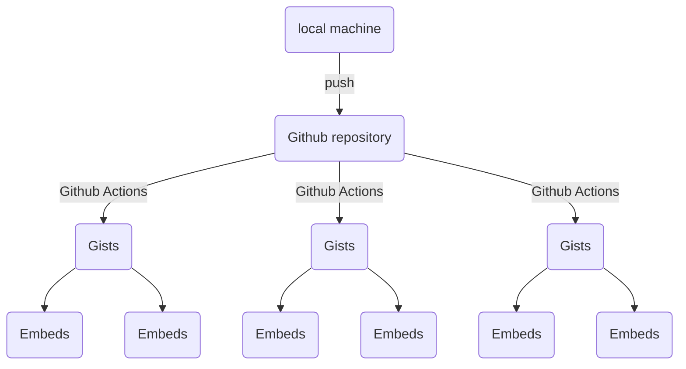

# Repo Gist Sync


A library to synchronize git repository to Github Gists



## Installation

Install from [PyPI](https://pypi.org/project/repo-gist-sync).

```shell
pip install repo-gist-sync
```

Dependencies: `requests`, `click`

## Example

1. Write the Code as follows (in the repository, examples folder):

- `get_user_id.py`

```python
#-- title: Get User's ID
#-- description: Code to retrieve user_id from username
#-- tags: python, medium_api, medium_api_py


# Import libraries
import os
from medium_api import Medium

#%%
# Get RAPIDAPI_KEY from the environment
api_key = os.getenv('RAPIDAPI_KEY')

#%%
# Create a `Medium` Object
medium = Medium(api_key)

#%%
# Get the `User` Object using "username" and print ID
user = medium.user(username="nishu-jain")
print(user.user_id)
```

- `get_user_id_output.txt`

```plain
1985b61817c3
```

2. Sync using `gistdirsync` CLI tool (from local machine or via Github Actions).

```shell
gistdirsync --auth-token $GIST_TOKEN --directory /path/to/examples
```

3. Resulting Gist looks like [this](https://gist.github.com/weeping-angel/c4e694ee6f2ede9d7261acd87152e8f7).

[Get User's ID] Code to retrieve user_id from username #python #medium_api #medium_api_py 

`get_user_id.py`
```python
# Import libraries
import os
from medium_api import Medium

# Get RAPIDAPI_KEY from the environment
api_key = os.getenv('RAPIDAPI_KEY')

# Create a `Medium` Object
medium = Medium(api_key)

# Get the `User` Object using "username" and print ID
user = medium.user(username="nishu-jain")
print(user.user_id)
```
`get_user_id_1.py`
```python
# Import libraries
import os
from medium_api import Medium
```

`get_user_id_2.py`
```python

# Get RAPIDAPI_KEY from the environment
api_key = os.getenv('RAPIDAPI_KEY')
```

`get_user_id_3.py`
```python
# Create a `Medium` Object
medium = Medium(api_key)
```

`get_user_id_4.py`
```python
# Get the `User` Object using "username" and print ID
user = medium.user(username="nishu-jain")
print(user.user_id)
```

`get_user_id_output.txt`
```plain
1985b61817c3
```

## Continuous Deployment with Github Actions

> **Note:** You can generate the GIST_TOKEN in [Github Settings](https://github.com/settings/tokens) and place it in "secrets" in repository's settings.

Place an YAML file under `.github/workflow/repo-gist-sync.yml` with the following content:


```yaml
name: GIST CD on main branch and example directory change

on:
  push:
    paths:
      - examples/**

jobs:
  build:
    if: github.ref == 'refs/heads/main'

    runs-on: ubuntu-latest

    strategy:
      matrix:
        python-version: ['3.8']

    steps:
    - uses: actions/checkout@v2

    - name: Set up Python ${{ matrix.python-version }}
      uses: actions/setup-python@v2
      with:
        python-version: ${{ matrix.python-version }}

    - name: Install repo-gist-sync
      run: pip install repo-gist-sync

    - name: Use "gistsyncdir" on "examples" directory
      run: gistdirsync --auth-token ${{ secrets.GIST_TOKEN }} --directory ./examples/
```

> **Note:** Change directory name ("examples") as per required in the yaml file.

## Features

- Supports python (`.py`) and shellscripts (`.sh`)
- Can write metadata (_title, description, & tags_) for gists in code file itself (`#--`).
- Break the code in smaller snippets using separator (`#%%`). 
- Can save the output in the corresponding gist by creating an additional file as "_filename_**_output.txt**"


