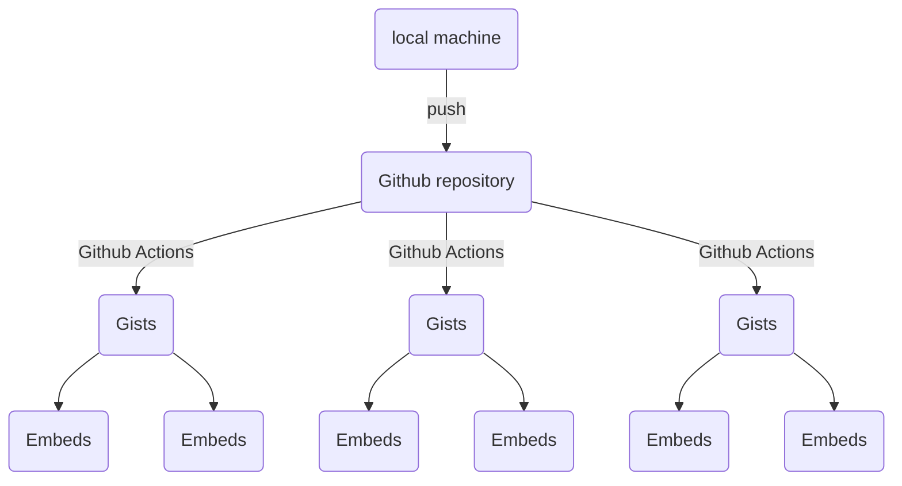

# Repo Gist Sync


A library to synchronize git repository to Github Gists



## Installation

Install from [PyPI](https://pypi.org/project/repo-gist-sync).

```shell
pip install repo-gist-sync
```

Dependencies: `requests`, `click`

## Example

```shell
gistdirsync --auth-token $GIST_TOKEN --directory /path/to/folder
```

## Continuous Deployment with Github Actions


```yaml
name: GIST CD on main branch and example directory change

on:
  push:
    paths:
      - examples/**

jobs:
  build:
    if: github.ref == 'refs/heads/main'

    runs-on: ubuntu-latest

    strategy:
      matrix:
        python-version: ['3.8']

    steps:
    - uses: actions/checkout@v2

    - name: Set up Python ${{ matrix.python-version }}
      uses: actions/setup-python@v2
      with:
        python-version: ${{ matrix.python-version }}

    - name: Install repo-gist-sync
      run: pip install repo-gist-sync

    - name: Use "gistsyncdir" on "python" directory
      run: gistdirsync --auth-token ${{ secrets.GIST_TOKEN }} --directory ./examples/
```

## Features

- Supports python (`.py`) and shellscripts (`.sh`)
- Can write metadata in file itself
- Break the code in smaller snippets
- can save the output in the corresponding gist by naming the file as "_filename_**_output.txt**"


